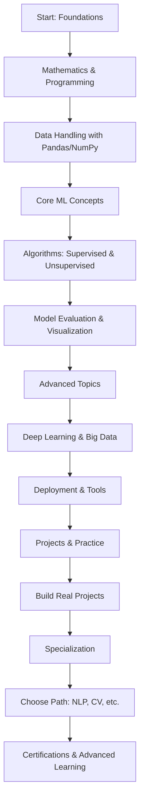

# Learning Roadmap for Machine Learning and Data Science

This roadmap provides a step-by-step guide to learning machine learning and data science from scratch. It covers foundational concepts, tools, and projects to build practical skills.

## Phase 1: Foundations
- **Mathematics Basics**: Linear Algebra, Calculus, Statistics, Probability
- **Programming**: Python basics (variables, loops, functions)
- **Data Handling**: Pandas, NumPy for data manipulation

## Phase 2: Core Concepts
- **Machine Learning Algorithms**: Supervised (Regression, Classification), Unsupervised (Clustering, Dimensionality Reduction)
- **Model Evaluation**: Cross-validation, Metrics (Accuracy, Precision, Recall, F1-Score)
- **Data Visualization**: Matplotlib, Seaborn

## Phase 3: Advanced Topics
- **Deep Learning**: Neural Networks, TensorFlow, PyTorch
- **Big Data**: Spark, Hadoop
- **Deployment**: Flask, Streamlit, Docker

## Phase 4: Projects and Practice
- Build projects like predictive models, recommendation systems
- Participate in Kaggle competitions
- Contribute to open-source

## Phase 5: Specialization
- Choose a path: NLP, Computer Vision, Time Series, etc.
- Advanced certifications (e.g., TensorFlow Developer Certificate)

## Visual Roadmap

*(This diagram renders in GitHub or compatible viewers.)*

## Resources
- Books: "Hands-On Machine Learning with Scikit-Learn, Keras, and TensorFlow"
- Online Courses: Coursera, edX, Udacity
- Communities: Reddit r/MachineLearning, Kaggle forums

Happy Learning!